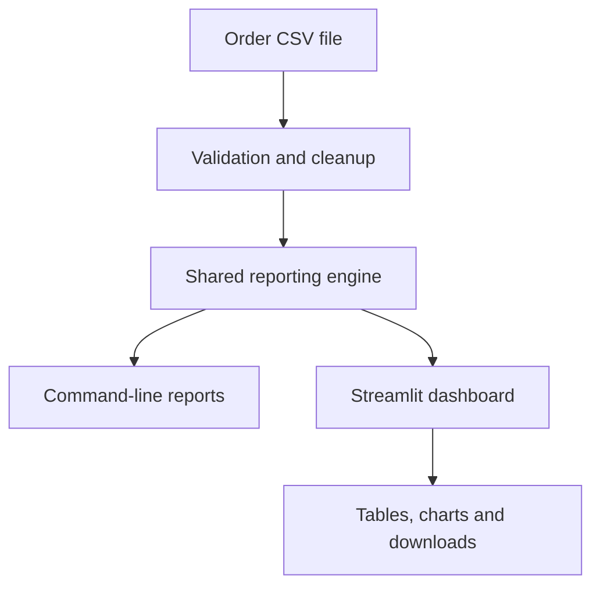
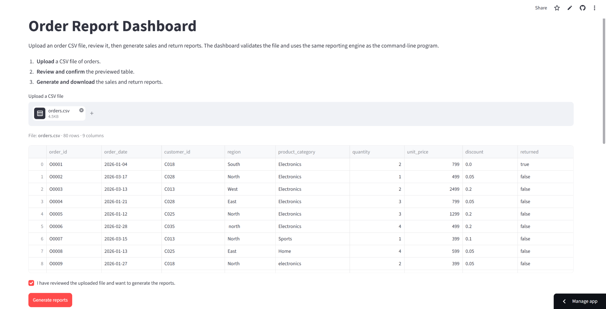
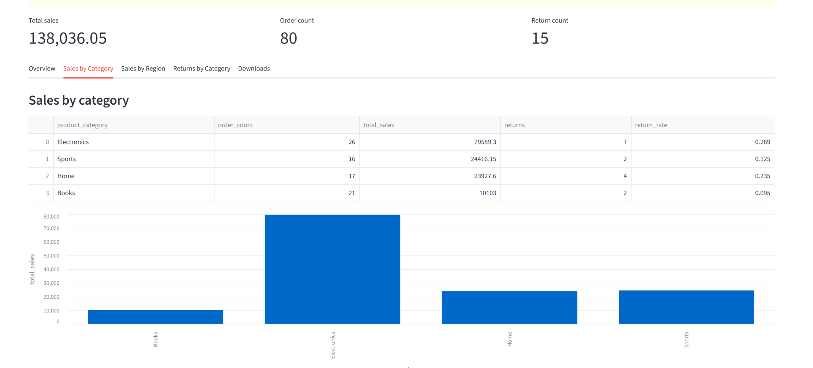
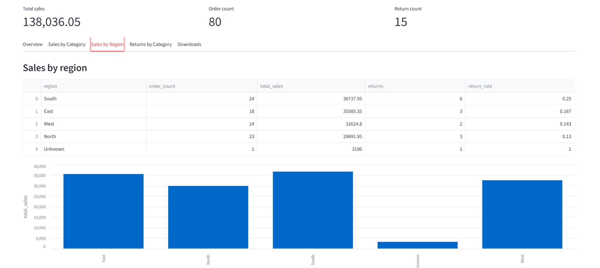
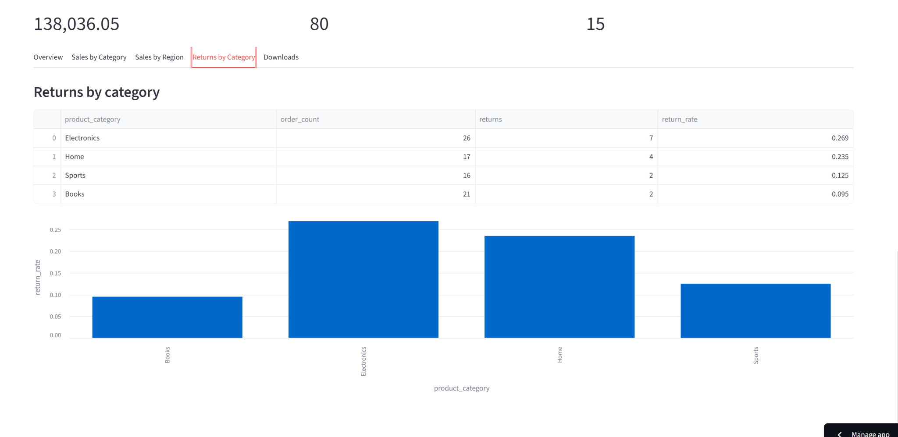
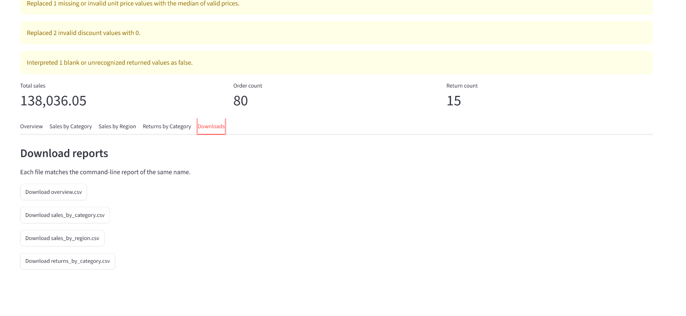

# Order Report Refactoring

A Python order-reporting program that reads order data, checks and cleans it, and creates sales and return reports. The project can be used from the command line or through a Streamlit dashboard.

**Live application:** [yunus-order-report.streamlit.app](https://yunus-order-report.streamlit.app)  
**GitHub repository:** [github.com/JunusEmre/order-report-refactoring](https://github.com/JunusEmre/order-report-refactoring)

## About the project

This project started with an existing Python script that already produced the correct reports. However, most of the work was placed inside one large file. Loading the data, cleaning it, calculating values, building reports, handling errors and saving files were all mixed together.

The goal was to improve the structure without changing the original results. The program was divided into smaller modules with clear responsibilities. Validation, logging, error handling and automated tests were then added. Finally, I built a Streamlit dashboard so that the program can also be used without working in a terminal.

## What the program does

The program follows a simple process:

1. The user uploads an order file in CSV format.
2. The file is shown as a preview before anything is processed.
3. The program checks that the required information is available and usable.
4. Some recoverable data problems are corrected and shown as warnings.
5. The program calculates sales and return statistics.
6. The results are displayed as summary figures, tables and charts.
7. The four finished reports can be downloaded as CSV files.



The command-line program and the dashboard use the same reporting engine. This avoids having two different versions of the calculations.

## Dashboard

### Upload and review

The uploaded file is displayed before the reports are generated. The user must review the table and confirm that it is the correct file.



### Sales by category

This report compares order count, total sales, returns and return rate for each product category.



### Sales by region

This report shows how sales and returns are distributed between regions. Missing region values are grouped under `Unknown` instead of being removed.



### Returns by category

This view makes it easier to compare return rates between the product categories.



### Download reports

All four reports can be downloaded directly from the dashboard.



## Reports produced

| Report | Purpose |
| --- | --- |
| `overview.csv` | Total sales, number of orders and number of returns |
| `sales_by_category.csv` | Sales, orders, returns and return rate by product category |
| `sales_by_region.csv` | Sales, orders, returns and return rate by region |
| `returns_by_category.csv` | Return count and return rate by product category |

For the included example data, the main results are:

| Measure | Result |
| --- | ---: |
| Total sales | 138,036.05 |
| Orders | 80 |
| Returns | 15 |

## Expected input

The input must be a CSV file containing these columns:

| Column | Meaning |
| --- | --- |
| `order_id` | Unique order identifier |
| `order_date` | Date of the order |
| `customer_id` | Customer identifier |
| `region` | Sales region |
| `product_category` | Product category |
| `quantity` | Number of items |
| `unit_price` | Price per item |
| `discount` | Discount written as a value between 0 and 1 |
| `returned` | Whether the order was returned |

The repository includes `data/orders.csv`, which can be used to test both the command-line program and the online dashboard.

## Data checking and cleanup

The program stops and gives a clear error when it cannot safely continue. Examples include a missing file, missing required columns, an empty table, blank identifiers, invalid dates, negative quantities or prices, and discounts outside the accepted range.

Some problems can be handled without stopping the program. These corrections are shown to the user as warnings:

- Missing region or category values become `Unknown`.
- Missing or unreadable quantity values become `1`.
- Missing or unreadable unit prices are replaced with the median of the valid prices.
- Unreadable discount values become `0`.
- Blank or unrecognized return values are treated as `False`.

This makes the result transparent: the user can see what was corrected instead of the program changing the data silently.

## Project structure

```text
order-report-refactoring/
├── .gitignore
├── README.md
├── code_review.md
├── order_report.py
├── requirements.txt
├── streamlit_app.py
├── data/
│   └── orders.csv
├── docs/
│   └── screenshots/
│       ├── upload-and-preview.png
│       ├── sales-by-category.png
│       ├── sales-by-region.png
│       ├── returns-by-category.png
│       └── download-reports.png
├── order_reporting/
│   ├── __init__.py
│   ├── config.py
│   ├── data.py
│   ├── exceptions.py
│   ├── logging_config.py
│   ├── pipeline.py
│   └── reports.py
├── output/
│   ├── overview.csv
│   ├── returns_by_category.csv
│   ├── sales_by_category.csv
│   └── sales_by_region.csv
└── tests/
    ├── fixtures/
    │   └── expected/
    │       ├── overview.csv
    │       ├── returns_by_category.csv
    │       ├── sales_by_category.csv
    │       └── sales_by_region.csv
    ├── test_baseline_behavior.py
    ├── test_config.py
    ├── test_data.py
    ├── test_entry_point.py
    ├── test_pipeline.py
    ├── test_reports.py
    ├── test_streamlit_app.py
    └── test_streamlit_helpers.py
```

## File map

| File or folder | Responsibility |
| --- | --- |
| `order_report.py` | Small command-line starting point |
| `streamlit_app.py` | Dashboard interface, upload flow, charts and downloads |
| `order_reporting/config.py` | Input and output path settings |
| `order_reporting/data.py` | Loading, checking and preparing order data |
| `order_reporting/reports.py` | Calculations for the four reports |
| `order_reporting/pipeline.py` | Connects the data and report steps |
| `order_reporting/exceptions.py` | Project-specific error types |
| `order_reporting/logging_config.py` | Console logging configuration |
| `data/` | Example input data |
| `output/` | Reports created by the command-line program |
| `tests/` | Characterization tests, unit tests and Streamlit tests |
| `tests/fixtures/expected/` | Protected copies of the original correct reports |
| `code_review.md` | Review of the problems found in the original script |

## Running the project locally

Python 3.11 is recommended.

### 1. Clone the repository

```bash
git clone https://github.com/JunusEmre/order-report-refactoring.git
cd order-report-refactoring
```

### 2. Create and activate a virtual environment

Windows PowerShell:

```powershell
python -m venv .venv
.venv\Scripts\Activate.ps1
```

macOS or Linux:

```bash
python3 -m venv .venv
source .venv/bin/activate
```

### 3. Install the dependencies

```bash
python -m pip install -r requirements.txt
```

### 4. Run the command-line program

```bash
python order_report.py
```

The generated CSV files are saved in the `output/` folder.

### 5. Run the dashboard

```bash
python -m streamlit run streamlit_app.py
```

The dashboard will normally open at `http://localhost:8501`.

## Automated tests

Run the full test suite with:

```bash
python -m pytest -q
```

The project currently has 64 passing tests. The tests cover the original report results, data cleanup, validation, configuration, report calculations, pipeline behaviour, controlled errors and the Streamlit interface.

The original report files are also stored as protected test fixtures. This means that the internal structure could be improved while continuously checking that the expected results did not change.

## Main improvements

- Split one large script into smaller modules with clear responsibilities.
- Removed repeated category and region calculation code.
- Replaced hard-coded paths with a configuration object.
- Added a proper `main()` entry point with no work performed during import.
- Added clear validation errors and recoverable warnings.
- Replaced operational `print()` statements with logging.
- Added automated tests before and after refactoring.
- Added a Streamlit interface without duplicating the report calculations.
- Kept uploaded files and generated dashboard reports in memory instead of storing them permanently.

## Current limitations

- Only CSV input is supported.
- The program uses a defined order-data format and is not a general report builder.
- There is no database, login system or user administration.
- The dashboard does not permanently store uploaded files.
- The project is intended for small and medium-sized datasets rather than very large data pipelines.

## Author

**Yunus Emre Capar**

Created as a Python refactoring project with a practical reporting interface.
